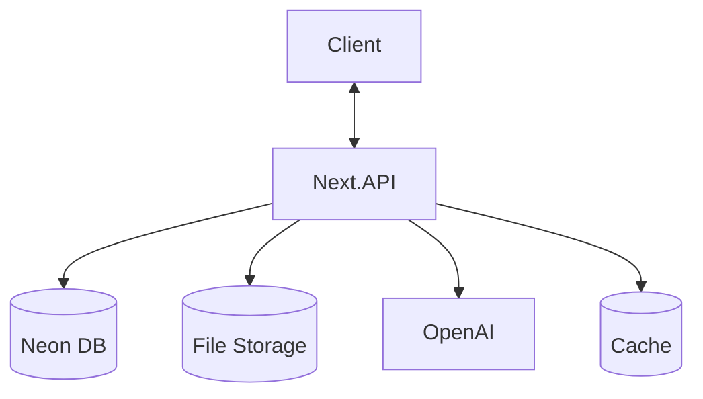
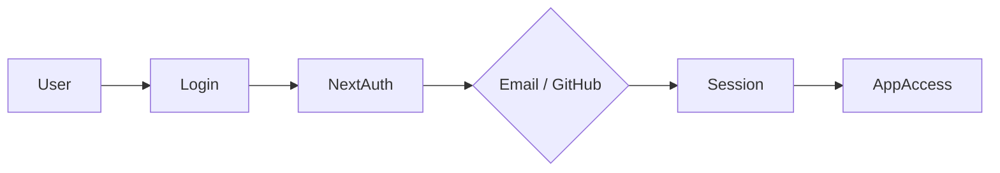
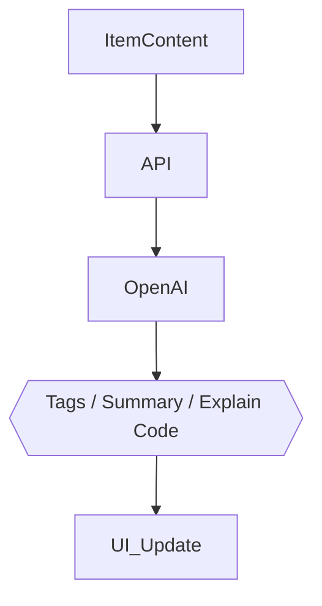

# DevStash — Project Overview

> **One fast, searchable, AI-enhanced hub for all your dev knowledge & resources.**

---

## The Problem

Developers keep their essentials scattered across too many places:

| What | Where |
|------|-------|
| Code snippets | VS Code, Notion, Gists |
| AI prompts | Chat history, random docs |
| Context files | Buried in project folders |
| Useful links | Browser bookmarks |
| Documentation | Random folders |
| Commands | `.txt` files, bash history |

This creates constant context switching, lost knowledge, and inconsistent workflows. DevStash brings all of it into one place.

---

## Target Users

- **Everyday Developer** — Needs fast access to snippets, prompts, commands, and links.
- **AI-first Developer** — Saves prompts, system messages, context files, and workflows.
- **Content Creator / Educator** — Stores code blocks, explanations, and course notes.
- **Full-stack Builder** — Collects patterns, boilerplates, and API examples.

---

## Tech Stack

| Layer | Choice |
|-------|--------|
| Framework | Next.js 16 / React 19 (monorepo via Nx) |
| Language | TypeScript |
| Database | PostgreSQL on AWS RDS Serverless v2 |
| ORM | Prisma 7 |
| Auth | NextAuth v5 (Email/password + GitHub OAuth) |
| File Storage | AWS S3 |
| AI | OpenAI `gpt-4o-mini` |
| CSS | Tailwind CSS v4 + shadcn/ui |
| Caching | Redis (optional, TBD) |

> ⚠️ **DB Rule:** Never use `db push`. Always create migrations that run in both dev and prod.

---

## Features

### A. Item Types

Items have a `contentType` of `text`, `url`, or `file`. The following are built-in **system types** (read-only, cannot be modified by users):

| Type | Icon | Color | Route |
|------|------|-------|-------|
| Snippet | `Code` | `#3b82f6` (blue) | `/items/snippets` |
| Prompt | `Sparkles` | `#8b5cf6` (purple) | `/items/prompts` |
| Command | `Terminal` | `#f97316` (orange) | `/items/commands` |
| Note | `StickyNote` | `#fde047` (yellow) | `/items/notes` |
| File | `File` | `#6b7280` (gray) | `/items/files` |
| Image | `ImageIcon` | `#ec4899` (pink) | `/items/images` |
| Link | `Link` | `#10b981` (emerald) | `/items/links` |

Items are accessible and creatable via a **slide-in drawer** for fast access. Users will be able to create **custom types** in a future release.

### B. Collections

Collections group items of any type. Items can belong to **multiple collections** (many-to-many).

Examples:
- `React Patterns` → snippets, notes
- `Context Files` → files
- `Python Snippets` → snippets
- `Interview Prep` → snippets, notes, commands

### C. Search

Full-text search across:
- Item title
- Content
- Tags
- Type

### D. Authentication

- Email/password
- GitHub OAuth

Both handled via **NextAuth v5**.

### E. Core Features

- Favorite collections and items
- Pin items to the top
- Recently used items
- Import code from a file
- Markdown editor for text-based types
- File upload for `file` and `image` types (AWS S3)
- Export data as JSON or ZIP
- Dark mode by default, light mode optional
- Add/remove items to/from multiple collections
- View which collections an item belongs to

### F. AI Features

- Auto-tag suggestions
- AI Summaries
- Explain This Code
- Prompt Optimizer

> All features — including AI and file uploads — are available to all users. No paywalls.

---

## Data Models

### Prisma Schema

> This schema is a starting point and **will evolve**

```prisma
model User {
  id                   String   @id @default(cuid())
  email                String   @unique
  password             String?
  isPro                Boolean  @default(false)
  stripeCustomerId     String?
  stripeSubscriptionId String?
  items                Item[]
  itemTypes            ItemType[]
  collections          Collection[]
  tags                 Tag[]
  createdAt            DateTime @default(now())
  updatedAt            DateTime @updatedAt
}

model Item {
  id          String   @id @default(cuid())
  title       String
  contentType String   // text | file
  content     String?  // used for text types
  fileUrl     String?
  fileName    String?
  fileSize    Int?
  url         String?
  description String?
  isFavorite  Boolean  @default(false)
  isPinned    Boolean  @default(false)
  language    String?

  userId      String
  user        User @relation(fields: [userId], references: [id])

  typeId      String
  type        ItemType @relation(fields: [typeId], references: [id])

  collectionId String?
  collection   Collection? @relation(fields: [collectionId], references: [id])

  tags        ItemTag[]

  createdAt   DateTime @default(now())
  updatedAt   DateTime @updatedAt
}

model ItemType {
  id       String   @id @default(cuid())
  name     String
  icon     String?
  color    String?
  isSystem Boolean  @default(false)

  userId   String?
  user     User? @relation(fields: [userId], references: [id])

  items    Item[]
}

model Collection {
  id          String   @id @default(cuid())
  name        String
  description String?
  isFavorite  Boolean  @default(false)

  userId      String
  user        User @relation(fields: [userId], references: [id])

  items       Item[]
  createdAt   DateTime @default(now())
  updatedAt   DateTime @updatedAt
}

model Tag {
  id     String @id @default(cuid())
  name   String
  userId String
  user   User @relation(fields: [userId], references: [id])

  items  ItemTag[]
}

model ItemTag {
  itemId String
  tagId  String

  item Item @relation(fields: [itemId], references: [id])
  tag  Tag  @relation(fields: [tagId], references: [id])

  @@id([itemId, tagId])
}
```

---

## UI / UX

### Layout

- **Sidebar** (collapsible): Item type links + latest collections. Becomes a drawer on mobile.
- **Main area**: Color-coded collection cards (background derived from dominant item type). Items within collections shown as color-bordered cards.
- **Item detail**: Slide-in drawer for quick access and editing.

### Design References

- [Notion](https://notion.so) — clean editor & sidebar
- [Linear](https://linear.app) — minimal, keyboard-friendly UI
- [Raycast](https://raycast.com) — fast command-palette style access

### General Principles

- Dark mode by default
- Desktop-first, mobile usable
- Clean typography, generous whitespace
- Subtle borders and shadows
- Syntax highlighting in code blocks
- Smooth transitions, hover states, toast notifications, loading skeletons

---

## API Architecture



---

## Auth Flow



---

## AI Feature Flow


---


## Development Workflow (For Course)

- **One branch per lesson** (students can follow & compare)
- Use **Cursor / Claude Code / ChatGPT** for assistance
- Sentry for runtime monitoring & error tracking
- GitHub Actions (optional for CI)

**Branch examples**:

```
git switch -c lesson-01-setup
```

---

## Roadmap

### **MVP**

- Items CRUD
- Collections
- Search
- Basic tags
- Free tier limits

### **Pro Phase**

- AI features
- Custom item types
- File uploads
- Export
- Billing & upgrade flow

### **Future Enhancements**

- Shared collections
- Team/Org plans
- VS Code extension
- Browser extension
- API + CLI tool

---

## Status

- In planning
- Ready for environment setup & UI scaffolding

---

🏗️ **DevStash — Store Smarter. Build Faster.**
